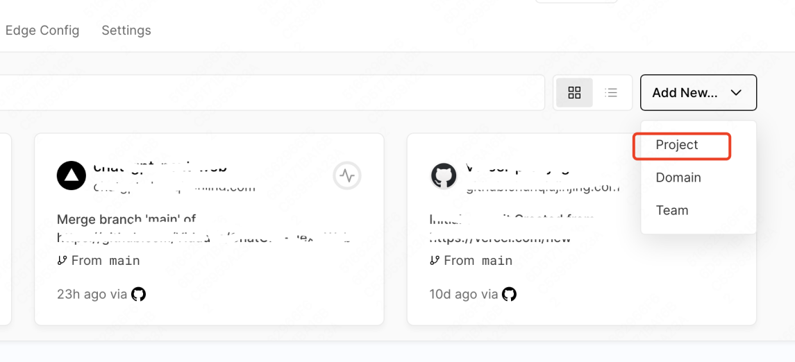
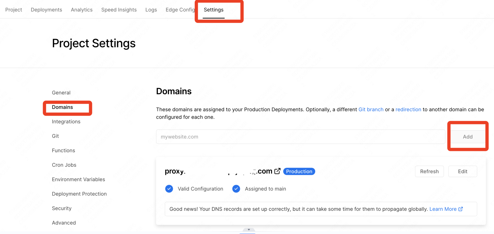
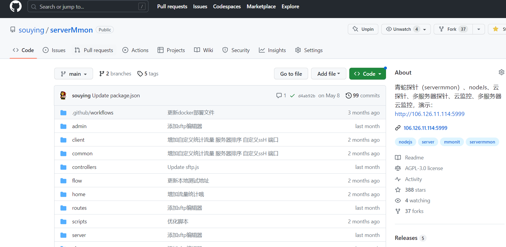
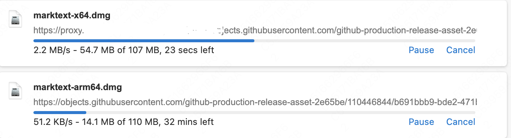

# Vercel API Proxy

[English README](./README_EN.md) | [部署教程](#部署) | [使用方法](#使用方法) | [示例](#示例)

> 🚀 基于 Vercel 的免费反向代理服务，支持代理全网接口，包括 OpenAI、Midjourney、GitHub、Google、Telegram 等

---

## 📋 目录

- [功能特性](#功能特性)
- [快速开始](#快速开始)
- [部署指南](#部署指南)
- [使用方法](#使用方法)
- [使用示例](#使用示例)
- [注意事项](#注意事项)
- [贡献与支持](#贡献与支持)

---

## ✨ 功能特性

- 🆓 **完全免费** - 利用 Vercel 每月 100GB 免费额度
- 🌐 **全协议支持** - 支持 HTTP、HTTPS、WSS 协议
- 🔓 **万能代理** - 可代理任意网站和 API 接口
- ⚡ **高速稳定** - Vercel 全球 CDN 加速，IP 稳定可靠
- 🛠️ **简单易用** - 一键部署，无需复杂配置
- 📱 **单页应用** - 支持单页面应用代理

---

## 🚀 快速开始

### 一键部署

点击以下按钮，立即部署到 Vercel：

[](https://vercel.com/import/project?template=https://github.com/souying/vercel-api-proxy)

---

## 📖 部署指南

### 方法一：一键部署（推荐）

1. 点击上方 **Deploy with Vercel** 按钮
2. 登录/注册 Vercel 账号
3. 点击 **Deploy** 完成部署

### 方法二：手动部署

1. **Fork 本项目**
   - 点击右上角 Fork 按钮，将项目复制到您的 GitHub 账号

2. **连接 Vercel**
   - 访问 [Vercel](https://vercel.com/) 并登录
   - 点击 **New Project** 创建新项目
   - 选择您 Fork 的仓库

   

3. **绑定自定义域名（可选但推荐）**
   - Vercel 默认提供 `.vercel.app` 子域名
   - 但该域名在国内可能访问不稳定，建议绑定自己的域名
   - 可申请 [Freenom 免费域名](http://www.dot.tk/) 或使用其他域名注册商

   

   **域名配置说明：**
   - 在您的域名服务商处添加 CNAME 记录
   - 将子域名指向 Vercel 提供的服务器地址

---

## 💡 使用方法

### 基本语法

访问格式：
```
https://你的域名/https/目标URL
https://你的域名/http/目标URL
```

### 映射规则

| 路径前缀 | 映射目标 |
|---------|---------|
| `/https/url` | → `https://url` |
| `/http/url` | → `http://url` |
| `/wss/url` | → `wss://url` |

### 网页版使用

部署完成后，直接访问您的域名，在输入框中输入完整 URL（需包含 `http://` 或 `https://`），点击 **Reverse Proxy** 按钮即可。

---

## 📝 使用示例

### 示例 1：OpenAI API 代理

**原始请求：**
```
https://api.openai.com/v1/chat/completions
```

**代理请求：**
```
https://你的域名/https/api.openai.com/v1/chat/completions
```

**在代码中使用：**

大多数开源项目都支持自定义 API Base URL，例如：

```python
# Python 示例
openai.api_base = "https://你的域名/https/api.openai.com/v1"
```

```javascript
// JavaScript 示例
const API_BASE = "https://你的域名/https/api.openai.com/v1";
```

> ✅ 中国大陆机器无需科学上网即可稳定访问

---

### 示例 2：GitHub 访问加速

**原始链接：**
```
https://github.com/souying/vercel-api-proxy
```

**代理链接：**
```
https://你的域名/https/github.com/souying/vercel-api-proxy
```



#### GitHub 下载加速

对于 GitHub Release 资源下载：

**原始链接：**
```
https://objects.githubusercontent.com/github-production-release-asset-2e65be/xxxxxx
```

**加速链接：**
```
https://你的域名/https/objects.githubusercontent.com/github-production-release-asset-2e65be/xxxxxx
```



> 📊 实测速度从 50KB/s 提升至 2-3MB/s

---

### 示例 3：Google 搜索代理

**原始链接：**
```
https://www.google.com/search?q=vercel-api-proxy
```

**代理链接：**
```
https://你的域名/https/www.google.com/search?q=vercel-api-proxy
```


---

## ⚠️ 注意事项

1. **流量限制** - Vercel 免费版每月提供 100GB 流量，请合理使用
2. **JS/CSS 路径** - 直接通过代理访问某些网站时，部分静态资源路径可能不正确，但不影响主要功能
3. **合规使用** - 请遵守当地法律法规，仅将此工具用于合法用途
4. **商业用途** - 本软件完全免费（商用除外），如用于商业目的请联系作者

---

## 联系方式

- 📦 GitHub: [@souying](https://github.com/souying/vercel-api-proxy)
- 💬 Telegram: 关注项目获取最新动态

---

## 📄 许可证

本项目仅供学习研究使用。

---

## 🔗 相关链接

- [Vercel 官网](https://vercel.com/)
- [Vercel 文档](https://vercel.com/docs)
- [本项目 GitHub](https://github.com/souying/vercel-api-proxy)

---

<p align="center">Made with ❤️ by <a href="https://github.com/souying">souying</a></p>
